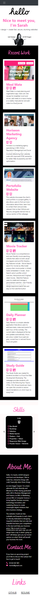

# Bootstrap Portfolio

The link to the deployed application is availble here: https://shemlock.github.io/bootstrap-portfolio/

## Description

The motivation for this project was to build a portfolio website, so that I could showcase my skills and talents to potential employers.

I wanted to create this website because having a portfolio with deployed web applications is beneficial for my career search journey, as employers can get a better idea of who I am and what I can do. 

  Creating this website helped me learn about: 
  * Bootstrap
  * Carousels
  * Jumbotron
  * HTML
  * CSS

## Table of Contents

- [Installation](#installation)
- [Usage](#usage)
- [Credits](#credits)
- [License](#license)
- [Features](#features)
  
## Installation
N/A

## Usage
* Scroll back up to the top of this README.md file to see a screenshot of the full webpage, you will also be able to see a link to the deployed application.
  
* Click on the link to open the website.
  
* When you open the website, you will be welcomed by the Jumbotron featuring a greeting, my name, a headline and avatar. At the top you will find the navigation bar with 5 links: WORK, SKILLS, ABOUT, CONTACT and LINKS. When you hover on a link it will change size and color. 
 
* Clicking on WORK will take you to the work section of the website where you can view 6 projects from my portolio. Hovering over any of the projects will zoom in on the image and the mouse will change from a curser to a pointer. Click on the project image and you will be taken to the live deployed website. There is a title and description for each project, and icons are featured for technology used. 
  
* Clicking on SKILLS will take you to the skills section of the websites. Skills are featured on cards on a carosuel, you can view the next skill card by clicking the right arrow. You can go back to the previous skill by clicking the left arrow. This is demonstrated in the video below. 

https://github.com/shemlock/bootstrap-portfolio/assets/147415364/15228a13-f24e-4c60-9ebe-1e3280c324c4

* Clicking on ABOUT will take you to the about me section of the website, where you can read some information about me.
  
* Clicking on CONTACT will take you to the contact section of the website, where you can find my contact details.

* Clicking on LINKS will take you to the links section of the website, where you will find links to my GitHub profile and Resume.

The website is responsive and suitable for both mobile view.

Here is an example of the website on an iPhone 12. 

  
## Credits
N/A

## License
MIT 

## Features

* Navigation bar with 5 links to sections of the website (WORK, SKILLS, ABOUT, CONTACT and LINKS)
* Links change size and colour upon hover.
* Jumbotron featuring a greeting, my name, a headline and avatar.
* Work Section featuring 6 projects, with information about each on and images that link to the deployed projects.
* Skills section with a carousel and cards for each skills, which the user can toggle between using the arrows. 
* About Me Section with information about myself.
* Contact Me Section with my contact details.
* Links section with links to my GitHub and Resume.
* Fully responsive UI suitable for laptop, tablet and mobile view. 

